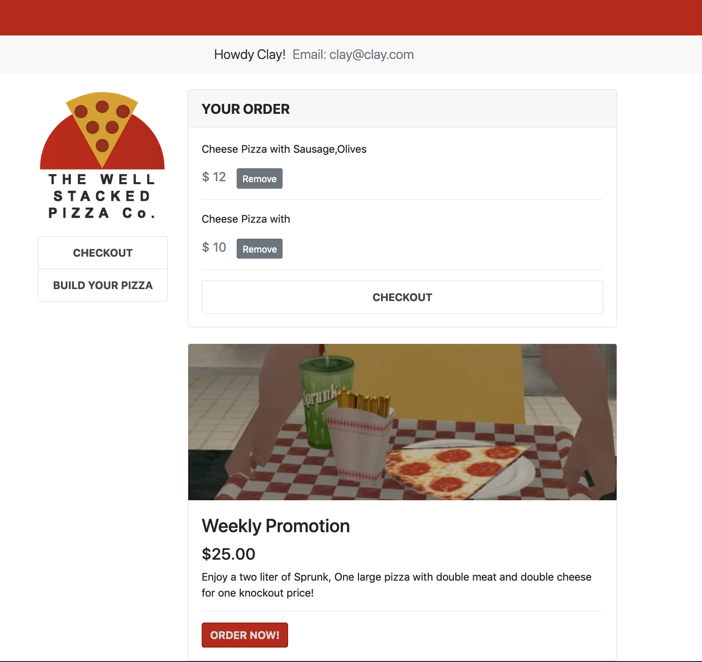
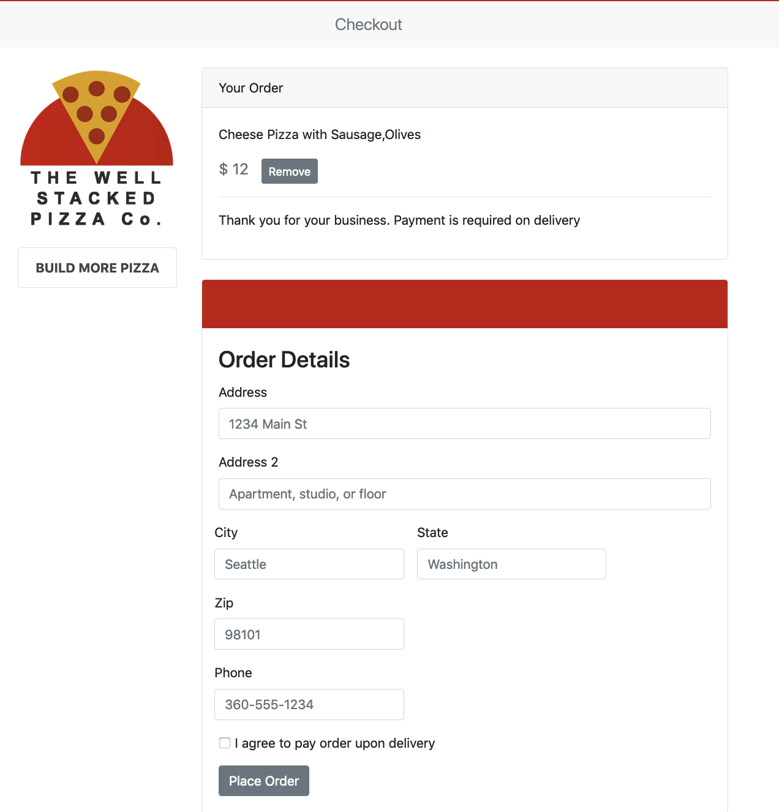
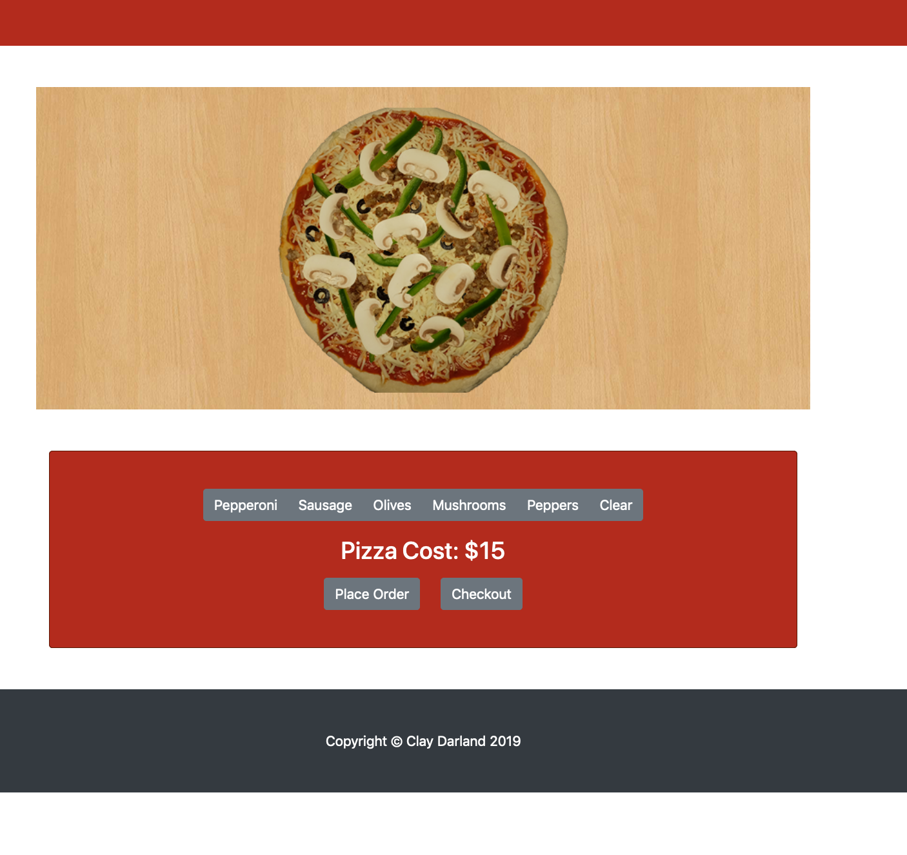

# PIZZA SHOP WITH PIZZA BUILDER

This is a app that is inspired by current trends in online pizza ordering. I built an app that showcases a fictitous pizza shop with a workflow that centers around the ability to create and order pizzas online. 

## Development stack

This program is built on Gatsby and React with Auth0 authentication.

## Foundation

The foundation of this project was built by my desire to learn more about Gatsby, Ecommerce and it's SEO advantages. I also wanted to learn more about the static site options out there today.

## User Experience

* User logins/registers with the intention of ordering pizza
* User is taken to the home page where they have the option to take advantage of promotions and pizza ordering. 
* Once they progress through the internal account pages, They will find that they have the ability to add as many custom pizzas to their order as they want.
* They proceed to checkout where they can completely their order by entering their address information. 

## Screenshots

## Development Update
#### Day 1-2
I began work by brainstorming on popular development stacks. After study, I decided on Gatsby because it drew the most appeal for this use case. I wanted a quick site that could also be optimized for SEO. I started laying out the project and defining state management. All pizza graphics were produced by myself during this time period. Bootstrap was integrated at this time as well as all bootstrap components. 

#### Day 3
I worked on the Pizzabuilder app. I laid out the state logic in a way that made the most react sense. After researching, I was able to get better understanding of how it works and adjusted it to better suit the Gatsby architecture. 

#### Day 4
I worked on Auth0 integration and following their best practices for integration. I ran into a couple problems with using React hooks within Gatsby. I refactored the code to use only hooks throughout this project. 

#### Day 5
I reached MVP on day 5 but had some bugs with passing state. I refactored the code once again to have a more intuitive cart/checkout layout and included a feature area for promomotional items. 

